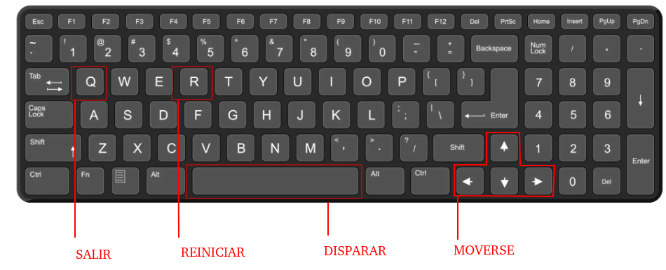

# proyectogodot

Repositorio del nuevo nivel y proyecto final

### Recursos del proyecto

- https://sporge.itch.io/coral-beach-2d-tileset

- https://creativekind.itch.io/necromancer-free

- https://mobilegamegraphics.itch.io/adventure-game-kit

### Nuevo nivel

Se desarrollo un nuevo nivel en el cual el pirata puede romper las paredes para avanzar y el nivel finaliza al tocar la bandera ubicada en el final del mapa.

### Proyecto final

Se desarrollo un plataformero 2d en el cual un condor debe ganar puntos destruyendo a 2 tipos de enemigos (cazador y carroñero) y acumulando puntos para superar el puntaje máximo.

#### Teclas utilizadas en el proyecto final

